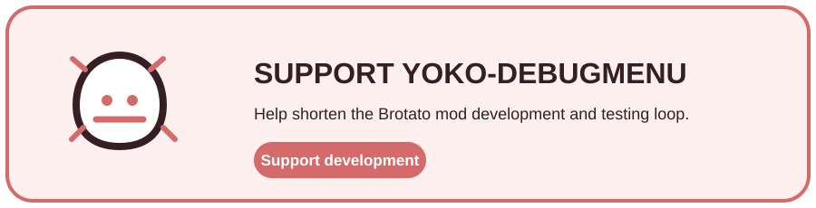

<div align="center">
  <h1>Yoko-DebugMenu</h1>
  <p><strong>An in-game debugging toolkit for Brotato development, testing, and rapid iteration.</strong></p>
  <p>Player state · Equipment · Enemies · Waves · Progression · Input</p>
  <p>
    <a href="https://github.com/CYoJkoY/Yoko-DebugMenu/releases"></a>
    <a href="https://github.com/CYoJkoY/Yoko-DebugMenu/actions/workflows/release.yml"></a>
    
    
    <a href="LICENSE"></a>
  </p>
  <p><a href="#what-it-is">Overview</a> · <a href="#tools">Tools</a> · <a href="#architecture">Architecture</a> · <a href="#installation">Install</a> · <a href="#development--support">Development</a></p>
</div>

> **Purpose:** shorten the loop from code or content change to observable in-game behavior without modifying Brotato's base files.

##  What it is

Yoko-DebugMenu adds a dedicated debug interface to Brotato. It is designed for mod development and testing: manipulate player state, equipment, enemies, waves, or progression from one panel and continue testing immediately.

The mod extends Brotato's existing debug service instead of creating a parallel gameplay loop.

##  Tools

| Area | Capabilities |
| :--- | :--- |
| Player | Give / remove items, weapons, and upgrades; add materials; randomize equipment; toggle invulnerability and invisibility; remove starting weapons |
| Combat | One-shot enemies and enable slow motion for targeted tests |
| Progression | Unlock or relock progression entries for repeatable runs |
| Enemies & waves | Browse registered enemy entities and exercise vanilla or compatible modded encounters |
| Input | Open with `T` or the supported player-1 trigger combination |

Text-entry controls are respected, so the keyboard shortcut does not interfere with `LineEdit` or `TextEdit` input.

##  Architecture

```text
Brotato debug service
        │
        ▼
extensions/debug_service.gd
        │
        ▼
   Yoko-DebugMenu
        │
        ├── Player tools
        ├── Enemy tools
        └── Wave / progression tools
```

`mod_main.gd` installs the extension for `res://singletons/debug_service.gd`. UI remains under `content/`; game-system integration remains under `extensions/`.

##  Installation

Requirements: **Brotato 1.15.4** and **Brotato Mod Loader 6.3.0**.

Download `DebugMenu-*.zip` from [Releases](https://github.com/CYoJkoY/Yoko-DebugMenu/releases) and place the ZIP in the Mod Loader `mods` directory.

Then launch Brotato and open the menu with `T` when the debug service is available.

##  Development & support

Keep debug UI behavior under `content/` and game-system integration under `extensions/`. New tools should target the narrowest Brotato service that owns the relevant state.

`manifest.json` is authoritative for version **1.1.0** and compatibility; release tags must match it exactly.

<a href="https://cyojkoy.github.io/Payment/"></a>

Development support: **https://cyojkoy.github.io/Payment/**

## License

This project is licensed under the [MIT License](LICENSE).
